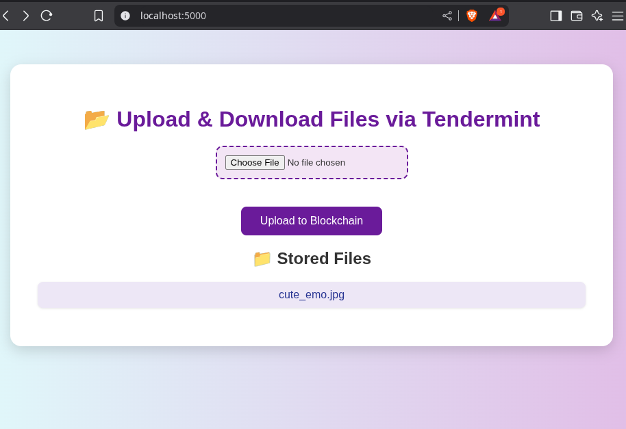

# 🗄️ Tendermint-Based File Storage with Web Interface

This project is a lightweight, single-node file storage system built using **Tendermint Core** and **Python**. It supports **uploading and downloading files** via a **Flask web interface**, with each file stored immutably on-chain (in Tendermint's app state and local storage).

---

## 🚀 Features

- 📦 Store files via Tendermint transactions
- 🌐 Web interface for uploading/downloading files
- ⚙️ ABCI app in Python (`file_store.py`)
- 🔐 Tamper-proof with Tendermint consensus
- 🧪 Minimal and easy to run locally

---

## 🧰 Project Structure

blockstore/
├── file_store.py # Tendermint ABCI app
├── web/
│ ├── app.py # Flask web backend
│ ├── templates/
│ │ └── index.html # Upload/download UI
│ └── static/ # Optional CSS
├── storage/ # Local file storage
├── README.md

yaml
Copy
Edit

---

## ⚙️ Requirements

- Python 3.10+
- Tendermint (v0.34.x tested)
- Flask
- Requests

Install dependencies:

```bash
pip install flask requests
🧑‍💻 Setup & Run
1️⃣ Start Tendermint
bash
Copy
Edit
tendermint init
tendermint node --proxy_app=tcp://127.0.0.1:26658
2️⃣ Run the ABCI App
bash
Copy
Edit
python3 file_store.py
Make sure file_store.py listens on 127.0.0.1:26658 as specified by Tendermint.

3️⃣ Run the Web Server
bash
Copy
Edit
cd web/
python3 app.py
Open browser at http://localhost:5000

🌐 API (Behind the Scenes)
Upload: Encodes filename:content → hex → Tendermint TX (broadcast_tx_commit)

Download: Reads from local ./storage/ directory

📝 Example TX Format
To store a file:

makefile
Copy
Edit
filename.txt:HelloWorld
is converted to hex and sent as:

nginx
Copy
Edit
curl "http://localhost:26657/broadcast_tx_commit?tx=0x66696c656e616d652e7478743a48656c6c6f576f726c64"
🧠 How it Works
File content is sent via a Tendermint transaction

file_store.py handles the TX, splits into filename/content, and stores locally

Flask interface lets users upload/download seamlessly

📂 Files Stored In
python-repl
Copy
Edit
./storage/
├── hello.txt
├── world.txt
...
🛠️ To Do / Improvements
✅ Web upload/download

 File hash lookup by Tendermint TX

 Authentication & access control

 Explore IPFS or external storage support

 Display TX logs or Tendermint height per upload


